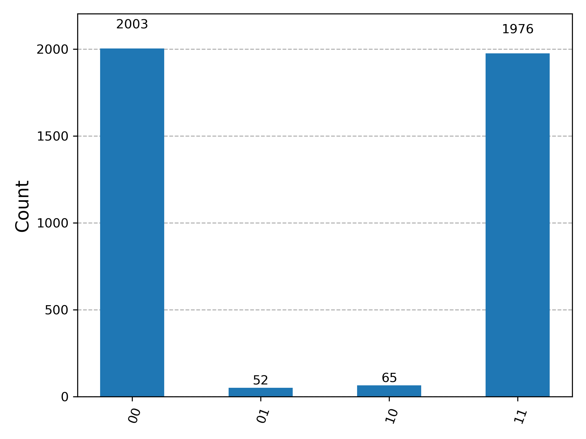

# Quantum Bell Test with IBM Quantum

This project demonstrates running a **Bell state** on IBM Quantum backend (`ibm_brisbane`).

## Files
- `bell_test.py` : Python script to build and execute the Bell circuit on IBM Quantum.
- `bell_result.png` : Result histogram from real quantum hardware.

## Result
The experiment shows that the measurement outcomes are **50% |00⟩ and 50% |11⟩**, proving quantum entanglement.



## How to Run
1. Set your IBM Quantum API token:
   ```powershell
   setx QISKIT_IBM_TOKEN "your_api_token"
